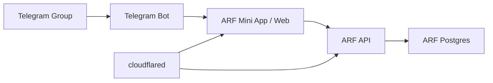

# Architecture

## Stack

- ARF app: Next.js with TypeScript.
- ARF database: Postgres.
- Background work: ARF worker process or scheduled jobs in the app container.
- Identity: Telegram Mini App signed init data.
- Notifications: Telegram bot.
- Ticketing/payment: ARF-owned approval and registration state, with direct Stripe checkout deferred until needed.
- CRM-lite: ARF-owned member notes, tags, and attendance history.
- Deployment: Docker Compose on a single VPS.
- Public ingress: cloudflared.
- Admin perimeter: Cloudflare Access.

## Service Diagram

## Ownership Boundaries

### ARF App

ARF owns identity linking, group-membership checks, member profiles, event discovery, RSVP state, waitlists, surveys, organizer admin, CRM-lite context, and future registration/payment state.

### ARF CRM-lite

ARF owns member notes, organizer tags, attendance history summaries, and follow-up views in the same Postgres database as event data. External CRM integration is deferred until the built-in admin workflows are insufficient.

### Telegram

Telegram owns chat, Mini App launch context, Telegram user identity, group membership source checks, and bot message delivery.

### Cloudflare

Cloudflare owns DNS, tunnel ingress, TLS termination, WAF-level protection, and Cloudflare Access for admin surfaces.

## Domain Map

- `arf.kurue.com`: public site, Telegram Mini App, member dashboard, organizer admin.
- `api.arf.kurue.com`: ARF backend routes and webhooks, unless folded into the Next.js app.

## Runtime Shape

The v1 Compose stack should run:

- `arf-web`: Next.js app and API routes.
- `arf-worker`: background jobs, CRM-lite reminders/rollups, Telegram notification queue, and future payment reconciliation jobs.
- `arf-postgres`: ARF database.
- `arf-redis`: queues and short-lived cache if required by the app.
- `cloudflared`: tunnel connector.
- `backup`: scheduled database and upload backup job.
