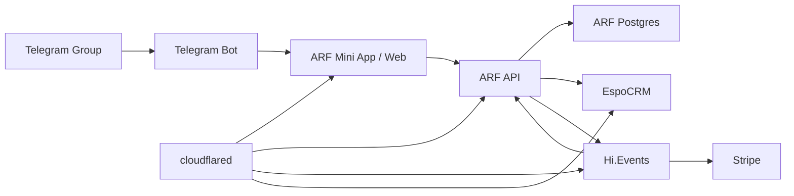

# Architecture

## Stack

- ARF app: Next.js with TypeScript.
- ARF database: Postgres.
- Background work: ARF worker process or scheduled jobs in the app container.
- Identity: Telegram Mini App signed init data.
- Notifications: Telegram bot.
- Ticketing/payment: Hi.Events with Stripe.
- CRM: EspoCRM.
- Deployment: Docker Compose on a single VPS.
- Public ingress: cloudflared.
- Admin perimeter: Cloudflare Access.

## Service Diagram

## Ownership Boundaries

### ARF App

ARF owns identity linking, group-membership checks, member profiles, event discovery, RSVP state, waitlists, surveys, Telegram notifications, organizer admin, and integration state.

### Hi.Events

Hi.Events owns annual retreat checkout after ARF approval, ticket inventory, Stripe payment, attendee/order records, QR check-in, refunds, and ticketing-related emails.

### EspoCRM

EspoCRM owns long-term contact records, organizer notes, CRM fields, attendance history summaries, and follow-up views. EspoCRM is not the system of record for event RSVP state.

### Telegram

Telegram owns chat, Mini App launch context, Telegram user identity, group membership source checks, and bot message delivery.

### Cloudflare

Cloudflare owns DNS, tunnel ingress, TLS termination, WAF-level protection, and Cloudflare Access for admin surfaces.

## Domain Map

- `arf.kurue.com`: public site, Telegram Mini App, member dashboard, organizer admin.
- `api.arf.kurue.com`: ARF backend routes and webhooks, unless folded into the Next.js app.
- `events.arf.kurue.com`: Hi.Events.
- `crm.arf.kurue.com`: EspoCRM behind Cloudflare Access.

## Runtime Shape

The v1 Compose stack should run:

- `arf-web`: Next.js app and API routes.
- `arf-worker`: background jobs, webhook retries, CRM sync, Telegram notification queue.
- `arf-postgres`: ARF database.
- `arf-redis`: queues and short-lived cache if required by the app.
- `hi-events`: Hi.Events application services.
- `hievents-db`: Hi.Events database.
- `hievents-redis`: Hi.Events queue/cache if required by upstream.
- `espocrm`: EspoCRM application.
- `espocrm-db`: EspoCRM database.
- `cloudflared`: tunnel connector.
- `backup`: scheduled database and upload backup job.

